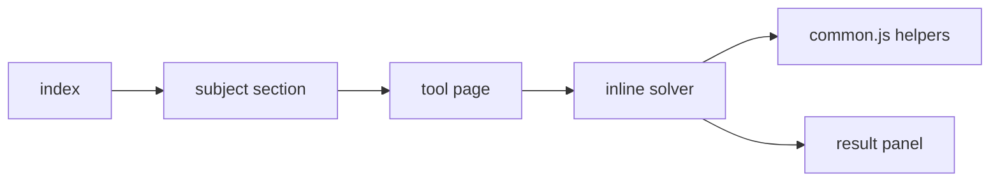

# aero tools

homework calculators for engineering and math

## Summary

A static site of browser calculators I use for aerospace engineering and math homework. Each page does one calculation: plug in what you know and it fills in the rest. Everything runs in the browser, nothing is stored or sent anywhere.

## Project structure

- `index.html` — the tool directory, grouped by subject
- `style.css` — the shared dark stylesheet
- `js/common.js` — formatting, interpolation, and linear-algebra helpers shared across tools
- `tools/<subject>/` — one self-contained page per tool

## Architecture



Each tool page is plain HTML with an inline script that reads the form, runs the calculation, and writes the result back into the page. Static hosting, no build step, no backend.

## Testing

Serve the folder and open it:

```
python3 -m http.server 8090
```

Then point a browser at localhost:8090. A node harness lives in `tests/` and runs every tool's solver against known answers:

```
node tests/verify.js
```

## Contributing

Branch off main, open a PR, and merge without fast-forward. Keep files small, use snake_case where it applies, LF line endings only, and keep any class or semester reference out of the pages.